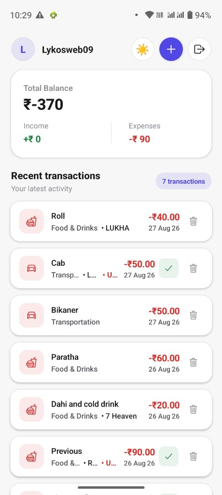
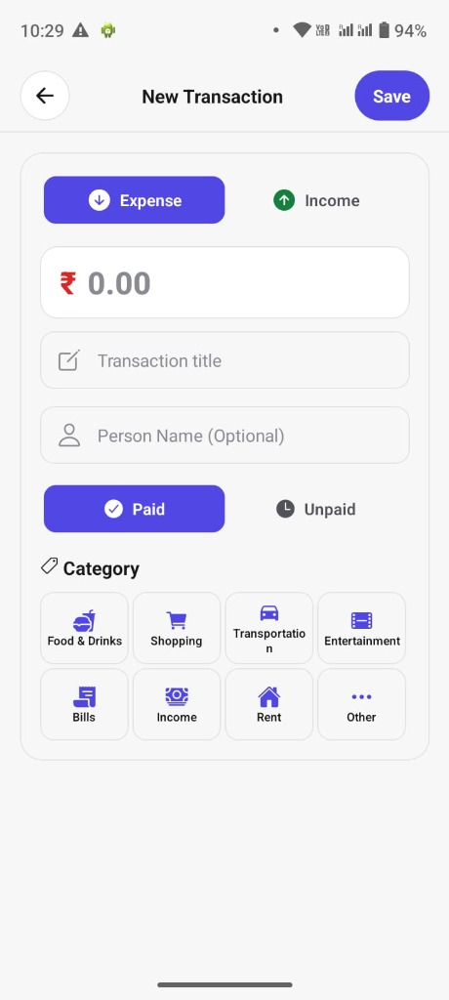
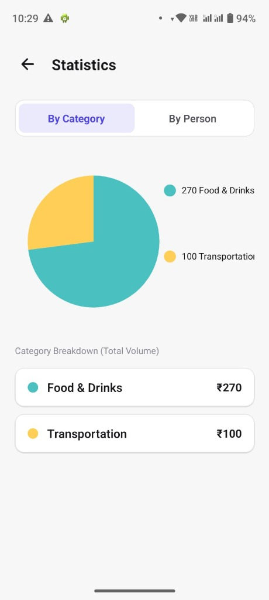
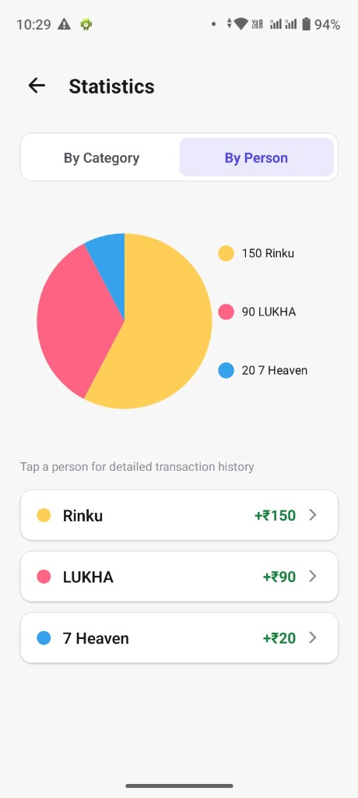
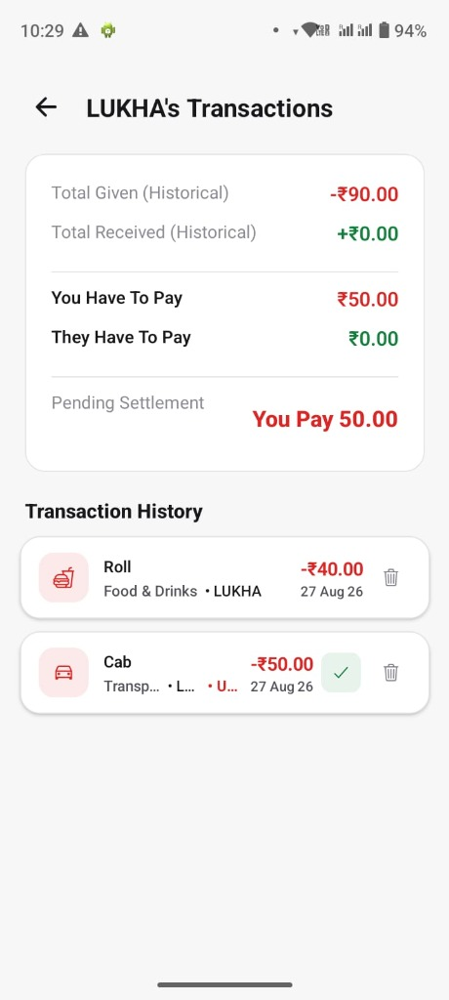

#  Hisab - Expense & Settlement Tracker

A robust, offline-first mobile application built to track personal expenses and manage peer-to-peer settlements. Designed with a clean, themeable UI and engineered for performance, **Hisab** ensures your financial data is always accessible, even without an internet connection.

---

##  Features

- **⚡ Offline-First Architecture:** Add, edit, and delete transactions locally. The app automatically queues your changes and syncs them to the cloud in the background once you're back online.
- **🤝 Peer-to-Peer Settlements:** Track exactly who owes you and who you owe. Easily mark debts as "Paid" and instantly see your net pending settlements.
- **📊 Interactive Analytics:** Visualize your spending habits with dynamic pie charts broken down by category and by person.
- **🎨 Dynamic Theming:** Choose from 6 beautifully crafted professional themes (Light, Dark, Coffee, Ocean, Forest, Purple) that adapt the entire UI instantly.
- **🔒 Enterprise-Grade Security:** Secure authentication powered by Clerk, supporting Google SSO and secure email verification.

---

## 🛠️ Tech Stack

**Frontend (Mobile App)**
- **Framework:** React Native & Expo (SDK 53)
- **Routing:** Expo Router (File-based navigation)
- **State Management & Caching:** React Context API + AsyncStorage (Custom Sync Queue)
- **UI Components:** Custom animated modals, React Native Chart Kit

**Backend (API & Database)**
- **Runtime:** Node.js & Express.js
- **Database:** PostgreSQL (Hosted on Neon.tech)
- **Authentication:** Clerk Auth (JWT verification & User Management)
- **Architecture:** RESTful API with optimistic UI updates

---

## 📸 Screenshots

  
  
  
  
  

---

## ⚙️ Local Development Setup

### Prerequisites
- Node.js (v18+)
- PostgreSQL Database (Local or Cloud)
- Clerk Account (For Auth Keys)
  
- Expo CLI

